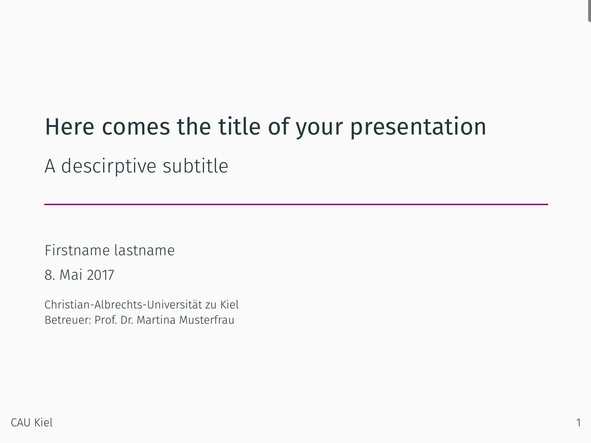
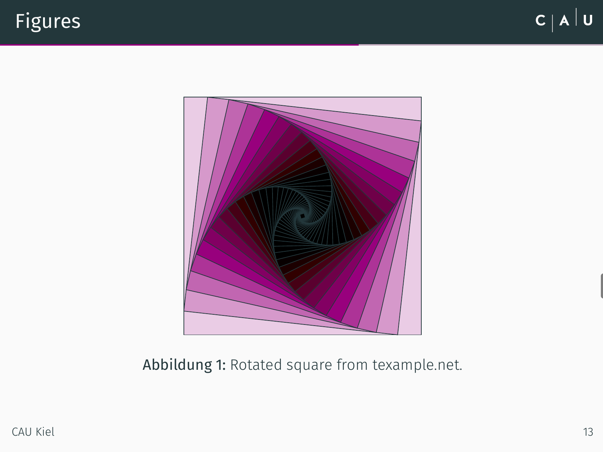
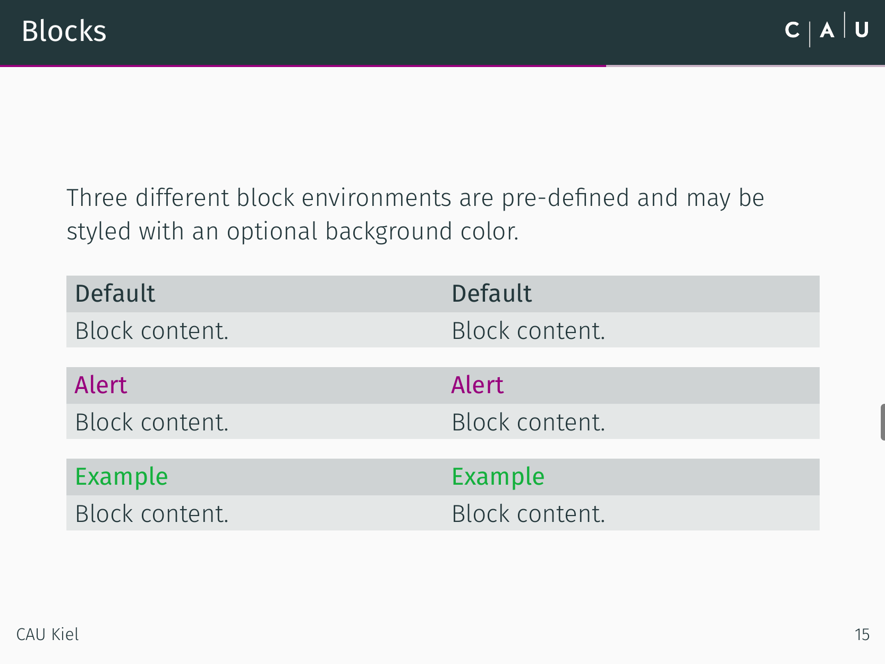

# CAU Kiel themed latex template (unofficial)
A latex beamer template for CAU Kiel students. The most up to date example document is [here](./helpfiles/presentation.pdf). Demo images below.

This is just a project template for future presentations. It's based on the awesome [Metropolis theme](https://github.com/matze/mtheme) by [matze](https://github.com/matze).

## 🚛 Installation

It's recommended (not mandatory though) to install Fira Fonts on your computer. For example from [here](https://www.fontsquirrel.com/fonts/fira-sans) (Fontsquirrel) or [here](https://github.com/mozilla/Fira) (GitHub Mozilla).

## 🔤 Usage

You must compile `presentation.tex` with XeLaTeX in order to use the `Fira` fonts. `pdflatex` will work too, but you'll have a hard time properly configuring `Fira` fonts.

## 🚧 My setup
I'm using the following command:
```shell
xelatex -output-directory=./helpfiles/ -synctex=1 -interaction=nonstopmode -output-driver="/usr/local/texlive/2016/bin/x86_64-darwin/xdvipdfmx -q -E" presentation.tex
```
You may need to adjust your the year `2016` to your texlive installation. You'll find the compiled PDF in the `./helpfiles/` subdirectory.

Flag | Description
---|---
`-output-directory`  |  The directory where auxiliary files and the compiled PDF will go
`-synctex`| Generates SyncTeX data for PDF previewers if nonzero. E.g. In texstudios built in previewer enables right click `Go to source`.
`-interaction`  |  Tells the TeX engine to run with minimal interaction with the user and as far as possible to 'go past' errors. (See [this](http://tex.stackexchange.com/a/258816/113577) post)
`-output-driver` | Not sure how to explain this one. But I can tell something about the forwarded flags. `-q` means to be quiet, so that `xdvipdfmx` won't produce any output and `-E` means to always try to embed fonts, regardless of licensing flags.

I'd recommend using an 'IDE' like texstudio. The aforementioned command is more or less just copied from there. Open `presentation.tex` and take a look at `Preferences` -> `Commands` -> `XeLaTeX`.

`.gitignore` was autogenerated by GitHub

## 🏡 Folderstructure
```
.
├── LICENSE
├── README.md
├── chapters
│   ├── ...
├── commands.tex
├── helpfiles
│   └── ...
├── images
│   └── ...
├── preamble.tex
└── presentation.tex
```

## 🔲 Todos
- [x] Explain custom commands in `commands.tex`
- [ ] Add example slides which show some functionality
- [ ] Add references to example document (to see it in action visit the official [Metropolis theme](https://github.com/matze/mtheme) repository for now)

## © Disclaimer
This is **not** an official latex beamer template of the CAU Kiel. It'd be great if it'll come that far though.

## 📈 Demo image






